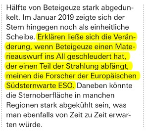

# Selecting and Marking Text
Prorammatically identifying and marking text is a frequent requirement. This folder is a collection of scripts that solve various tasks in this area.

## 1. Finding "real" words
Page method `getText("words")` delivers a list of tuples. Each tuples identifies a string without embedded spaces, together with its position on the page.

The method knows nothing about the meaning of these strings: it will identify just everything as a "word", that is surrounded spaces.

If you however are looking for occurrences of a certain word, you need a mechanism that strips off punctuation like commas or colons, maybe also numerical components or combinations with other words.

Script `mark-words.py` aims to solve this problem: inside the strings of the tuples of `getText("words")` it will identify alphabetic substrings and calculate the respective subrectangles.

The demo script looks for and marks all "real" words contained in a list:

* remove punctuation characters and digits
* only accept exact matches - no compounds with other words, etc.

Please note, that the only two exact matches have indeed been found.

Feel free to adapt the selection algorithm to your needs: e.g. use regular expressions.

## 2. Highlighting Textlines
This is possible since some time using

`page.addHighlightAnnot(start=point1, stop=point2, clip=rect)`.

The idea is to mark text across multiple consecutive lines, where the **_start_** and the **_stop_** points may be somewhere in the middle of their respective lines.

The short script `mark-lines.py` is an example for this.

For a satisfactory result, you must provide three information pieces. There is no general rule for how to do this. This example aims to help you find a solution for your situation.
1. The **_start point_**: We search for string **"im vorfeld solch"** and make sure that there is only one hit. the top-left corner of this rectangle is our start point.
2. The **_stop point_**: We similarly search for and ensure a unique string **"stark aus."** The bottom-right corner of that returned rectangle is our end point.
3. The **_clip rectangle_**: In many cases you can let default it to the page rectangle. In our case however, text is organized in **_three columns_**, and we certainly want to limit line marking to only one of them. Setting the clip rectangle width to a little more than one third of the page rectangle did the job in this case.

Of course things are a lot easier if you do all this in a GUI script, where the user can provide this information with the mouse.

**_Changes made in PyMuPDF v1.18.2_** let you also cope with **_hyphenated words_** across line breaks. This allows much simpler specifications.

Script `mark-lines2.py` searches for a (unique) sentence, omitting any hyphens. The several returned hit rectangles deliver all 3 required parameters, 'stat, 'stop' and 'clip'.

